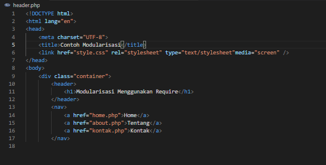
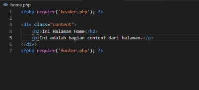

# Lab9Web

# NAMA  : Ibnu Fajar
# NIM   : 312010420
# KELAS : TI. 20. A1

**Langkah-langkah Praktikum** 
Pertama-tama membuka XAMPP, lalu kalian buat file baru dengan nama **header.php** 
 
 

**Buat file baru dengan nama footer.php** 
 

**Buat file baru dengan nama home.php** 
 
 

**Buat file baru dengan nama about.php** 
 
 

